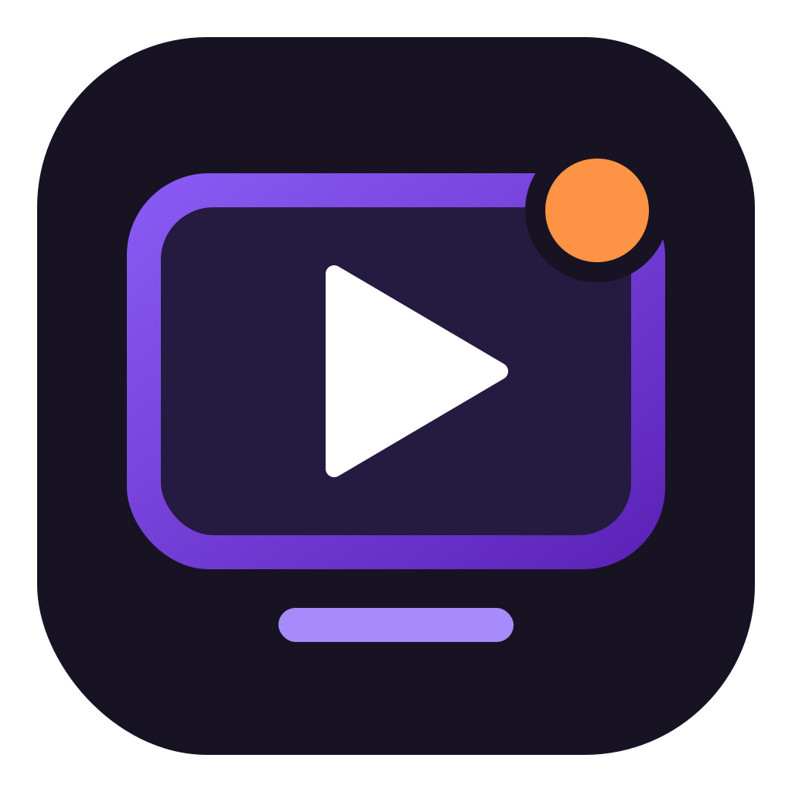

<p align="center">
  
</p>

<h1 align="center">Reaction Station</h1>

<p align="center"><strong>Record your reactions. Edit your commentary. Create for YouTube.</strong></p>

Reaction Station is a free, open-source desktop screen recorder and video editor by **Clatasha**, focused on YouTubers who react to videos and content online.

Capture what you are watching alongside your webcam and voice, then edit the recording into a reaction video. Whether you are discussing a trailer, responding to an interview, reviewing gameplay or sharing your take on an online clip, Reaction Station brings screen recording and editing into one app.

## Create your next reaction video

- **Capture the content** — record a browser window, another app or your entire screen.
- **Add your reaction** — record your microphone and system audio, with a webcam overlay for your face.
- **Control your take** — configurable global recording hotkeys and live audio volume/mute controls.
- **Mix your reaction** — Windows native recordings open with separate microphone and desktop audio tracks for independent editing.
- **Frame your camera** — adjust the webcam position, shape, roundness and mirroring.
- **Edit the recording** — trim sections, crop the picture and change the speed of individual segments.
- **Build your timeline** — drop video, image and audio files into the sequence or overlay lanes, with a scrolling timeline and visual animation presets.
- **Organize your media** — a three-column Library with search, reusable media, custom sticker imports and collapsible AI chat.
- **Keep sound in sync** — imported video/audio pairs are linked by default; unlink them for independent edits.
- **Control your tracks** — rename, lock, hide or mute tracks; move added media between compatible rows, and disable items without deleting them.
- **Recover missing files** — locate a moved source while keeping your timeline edits.
- **Add context** — use captions, text, arrows, images and zooms to support your commentary.
- **Export your video** — save an MP4 in the aspect ratio and resolution that suit your channel.

The editing tools also include backgrounds, cursor effects, customizable keyboard shortcuts and optional AI-assisted edits using your own provider credentials.

## Our direction

Reaction Station is being developed around the workflow of reaction creators: watching content, recording commentary and preparing the result for YouTube. Dedicated reaction features will build on the recording and editing tools already in the codebase.

Ideas for improving that workflow are welcome through [pull requests](https://github.com/Clatasha/Reaction-Station/pulls).

## Downloads

Windows test installers are available from the [Reaction Station Windows test workflow](https://github.com/Clatasha/Reaction-Station/actions/workflows/reaction-station-windows-test.yml). Open a successful run and download the `reaction-station-windows-test` artifact. Stable releases will be posted on [this repository's Releases page](https://github.com/Clatasha/Reaction-Station/releases) when ready.

## Development

Development is public and the project is in its early stages. The codebase includes Windows, macOS and Linux support; Reaction Station installers still need packaging and desktop testing before release.

For local development, use Node.js **22.22.1** and npm **10.9.4**:

```bash
git clone https://github.com/Clatasha/Reaction-Station.git reaction-station
cd reaction-station
npm ci
npm run dev
```

Native recording and rendering components need platform-specific tooling and build steps. See the [technical documentation](technical-documentation/README.md) and [contributor guide](CONTRIBUTING.md) for details.

Existing projects continue to use the `.openscreen` file extension for compatibility. Microsoft Store publication requires a separate Reaction Station registration.

## License and credits

Reaction Station is licensed under the [MIT License](LICENSE). Bundled third-party components have their own terms, documented in [Third-party notices](THIRD-PARTY-NOTICES.md).

Built on [OpenScreen](https://github.com/getopenscreen/openscreen), originally created by **Siddharth Vaddem** and continued by the **OpenScreen contributors**. Their copyright notices and license are retained. Reaction Station's branding and further development are by **Clatasha**.
